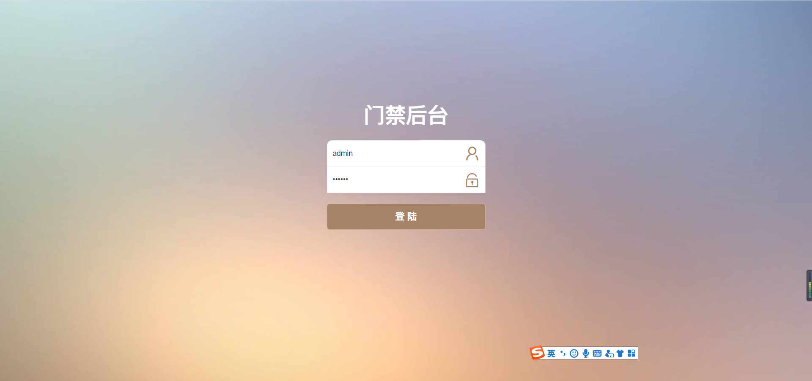

#### 介绍
ESP8266门禁
通过ESP8266接入RC522读卡器实现刷卡触发继电器开门操作

#### 软件架构
1.增加API功能 使用LayUI前端界面 管理设备配置功能

2.接入物联网MQTT通讯，实现微耕卡号权限下发，也是通过后端页面进行配置

3.权限下发成功，会在设备记录提供了查看页面(txt存储)

4.记录刷卡记录(txt存储)

#### 备注
 由于ESP8266闪存有限制大小现在、存储慢了以后就不会存储了
 
 [读卡功能参考](https://blog.csdn.net/qq_31878883/article/details/88971935) 